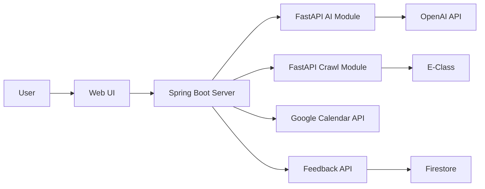

<div align="center">

# Calainder

### Record Less, Remember More

텍스트와 이미지 속 일정 정보를 AI가 분석하여<br>
Google Calendar에 반영하는 스마트 일정 관리 서비스

[](https://calainder.kr)
[](https://www.notion.so/33c49c16438d80bda22ac562b87e84e4)
[](https://github.com/gasic37200/Calainder)

</div>

---

## Overview

Calainder는 일정 정보를 다시 정리하고 직접 입력해야 하는 번거로움을 줄이기 위해 만든 서비스입니다.

자연어 또는 이미지를 입력하면 AI가 일정 정보를 분석합니다.<br>
사용자는 분석된 결과를 확인한 뒤 자신의 Google Calendar에 바로 등록할 수 있습니다.

학교 E-Class의 과제 일정도 가져올 수 있으며, 이미 등록된 일정은 중복 생성하지 않고 기존 일정을 수정합니다.

## Key Features

| 기능 | 설명 |
|---|---|
| AI 일정 분석 | 텍스트와 이미지에서 제목, 날짜, 시간을 추출합니다. |
| 다중 일정 분리 | 한 문장에 여러 일정이 있어도 각각의 일정 카드로 분리합니다. |
| 반복 일정 관리 | 매일, 매주, 매달 반복 일정을 생성하고 특정 일정 또는 전체 반복 일정을 수정합니다. |
| Google Calendar 연동 | Google OAuth2 인증을 통해 일정 등록, 조회, 수정, 삭제를 처리합니다. |
| E-Class 과제 동기화 | 학교 과제를 수집하여 Google Calendar에 반영합니다. |
| 중복 일정 방지 | 과목명과 일정 제목을 기반으로 고정 ID를 생성하여 기존 일정을 갱신합니다. |
| 피드백 수집 | 공용 Feedback API를 통해 사용자 피드백을 저장하고 조회합니다. |

### 사용 예시

```text
오늘 7시부터 8시까지 운동하고, 9시부터 도서관에 가야 해.
```

### 출력 예시

```text
제목       시작    종료
운동       19:00 - 20:00
도서관     21:00 - 22:00

※ 종료 시간이 입력되지 않은 일정은 기본적으로 1시간 뒤에 종료됩니다.
분석된 일정 카드에서 설명, 장소, 반복, 알림 설정을 수정한 뒤 Google Calendar에 등록할 수 있습니다.
```

## Architecture



## Tech Stack

### Application


### API & Automation


### Infrastructure


## Getting Started

<details>
<summary>Docker Compose로 실행하기</summary>

### 1. 저장소 복제

```bash
git clone https://github.com/gasic37200/Calainder.git
cd Calainder
```

### 2. 외부 서비스 준비

실행을 위해 다음 설정이 필요합니다.

| 서비스 | 필요한 설정 |
|---|---|
| Google Cloud Console | OAuth 2.0 클라이언트 생성 및 Google Calendar API 활성화 |
| OpenAI Platform | API Key 발급 |
| Feedback API | 피드백 기능을 사용할 경우 별도 실행 |

Google OAuth의 승인된 리디렉션 URI에는 다음 주소를 추가합니다.

```text
http://localhost:8888/login/oauth2/code/google
```

### 3. 환경변수 설정

각 서비스 디렉터리에 `.env` 파일을 생성합니다.

`calainder-server/.env`

```env
GOOGLE_CLIENT_ID=
GOOGLE_CLIENT_SECRET=
GOOGLE_REDIRECT_URI=http://localhost:8888/login/oauth2/code/google
AES_KEY=
FASTAPI_AI_BASE_URL=http://calainder-ai:8000
FASTAPI_CRAWL_BASE_URL=http://calainder-crawl:9000
FEEDBACK_API_BASE_URL=http://feedback-api:7000
```

`calainder-ai/.env`

```env
OPENAI_API_KEY=
```

`calainder-crawl/.env`

```env
AES_KEY=
```

> `AES_KEY`는 Spring Boot 서버와 크롤러 모듈에 동일한 값을 설정해야 합니다.<br>
> AES 키 길이는 16, 24, 32바이트 중 하나여야 합니다.

### 4. 실행

```bash
docker compose up --build -d
```

[http://localhost:8888](http://localhost:8888)에 접속합니다.

> 피드백 기능까지 사용하려면 [Feedback API](https://github.com/gasic37200/Feedback-api)를 함께 실행해야 합니다.

</details>

## API Reference

<details>
<summary>Spring Boot Server API</summary>

| Method | Endpoint | 인증 | 설명 |
|---|---|---|---|
| `POST` | `/api/ai/schedule` | 불필요 | 텍스트 또는 이미지를 분석하여 일정 목록 반환 |
| `POST` | `/api/calendar/lookup` | Google 로그인 | 지정한 기간의 일정 조회 |
| `POST` | `/api/calendar/events` | Google 로그인 | 일정 등록 |
| `PATCH` | `/api/calendar/events` | Google 로그인 | 일정 수정 |
| `DELETE` | `/api/calendar/events/{id}` | Google 로그인 | 일정 삭제 |
| `POST` | `/api/crawl/schedule` | Google 로그인 | E-Class 과제 수집 및 등록, SSE 상태 반환 |
| `GET` | `/api/feedback` | Google 로그인 | 로그인 사용자의 피드백 조회 |
| `POST` | `/api/feedback` | Google 로그인 | 로그인 사용자의 피드백 저장 또는 수정 |

### 일정 분석 요청

`POST /api/ai/schedule`

Content-Type: `multipart/form-data`

| 필드 | 타입 | 필수 | 설명 |
|---|---|---|---|
| `prompt` | `String` | 조건부 | 분석할 자연어 일정 |
| `image` | `File` | 조건부 | 분석할 일정 이미지 |

`prompt`와 `image` 중 하나 이상을 전달해야 합니다.

</details>

<details>
<summary>Internal Module API</summary>

| 모듈 | Method | Endpoint | 설명 |
|---|---|---|---|
| AI | `POST` | `/api/ai/schedule/text` | 자연어 일정 분석 |
| AI | `POST` | `/api/ai/schedule/image` | 이미지 일정 분석 |
| Crawler | `POST` | `/api/crawl/schedule` | 암호화된 E-Class 로그인 정보로 과제 일정 수집 |

</details>

## Project Structure

```text
Calainder/
├── calainder-server/       # Spring Boot API 서버 및 Web UI
├── calainder-ai/           # OpenAI API 기반 일정 분석 모듈
├── calainder-crawl/        # Playwright 기반 E-Class 크롤러
└── docker-compose.yml      # 서비스 실행 구성
```

## Security

- Google OAuth2 인증을 통해 캘린더 접근 권한을 관리합니다.
- E-Class 로그인 정보는 AES 방식으로 암호화한 뒤 크롤러 모듈로 전달합니다.
- `.env`, 가상환경, 캐시, 빌드 결과는 Git과 Docker 이미지에 포함하지 않습니다.

## Release Notes

### `v1.5.0`

- 매일, 매주, 매달 반복 일정 생성 및 조회 기능을 추가했습니다.
- 반복 일정 수정 시 특정 일정만 수정하거나 전체 반복 일정을 변경할 수 있도록 수정 범위를 분리했습니다.
- 반복 일정 및 알림 설정 UI를 정리하고, 요일 선택 시 화면이 이동하던 문제를 수정했습니다.

<details>
<summary>이전 버전 보기</summary>

| 버전 | 주요 변경 사항 |
|---|---|
| `v1.4.1` | Docker 이미지에 불필요한 파일이 포함되지 않도록 모듈별 `.dockerignore` 추가 |
| `v1.4.0` | AI 다중 일정 추출, E-Class 일정 중복 방지, 공용 피드백 API 연동, 모듈별 `.env` 기반 Docker Compose 구성 |
| `v1.3.0` | 일정 조회·수정 UX 개선, 리마인더 설정 흐름 정리, Google Calendar 연동 안정화 |
| `v1.2.2` | 로그인 흐름 개선, AI 프롬프트 구조화, Google OAuth 심사 대응 페이지 보완 |
| `v1.2.0` | Docker 실행 환경 구성, 크롤러 로그 개선 |

</details>
